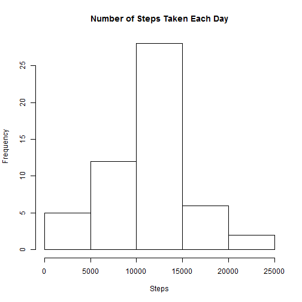
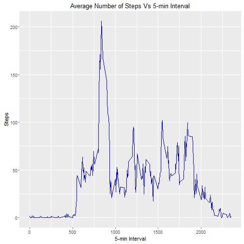
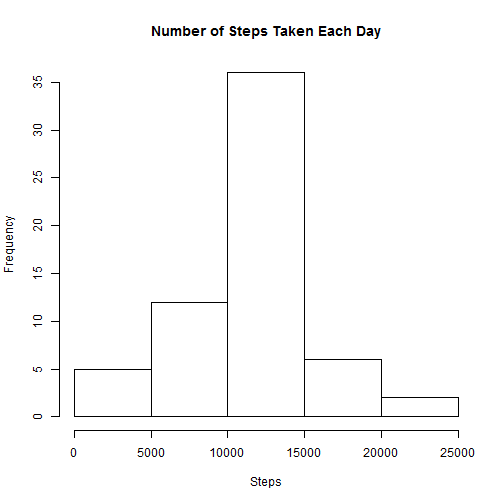
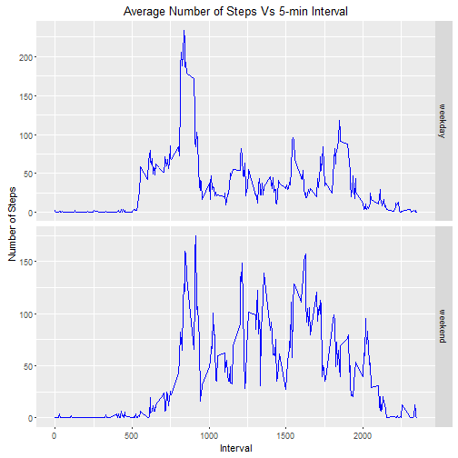

#This is Coursera Data Specialization #
#Course 5 -> Assignment 2 #


###Data Source###
The data for this assignment can be downloaded from the course web site:

 - **Dataset**: Activity monitoring data [52K]

The variables included in this dataset are:  
- **steps**: Number of steps taking in a 5-minute interval (missing values are coded as NA)  
- **date**: The date on which the measurement was taken in YYYY-MM-DD format  
- **interval**: Identifier for the 5-minute interval in which measurement was taken  

The dataset is stored in a comma-separated-value (CSV) file and there are a total of 17,568 observations in this dataset.  

###Data Preparation###

The following data preparation steps are needed for this exercise:  
- **Date Conversion**: Date is read in as a string. Convert it into a POSIX date  
- **Weekday**: Determine the weekday on which the date falls  


```r
data <- read.table("activity.csv", sep = ",", header = T, na = "NA")
data$date <- as.Date(data$date, "%Y-%m-%d")
data$weekday = weekdays(data$date)
```

###Data Exploration###
**What is mean total number of steps taken per day?**  
1. Aggregate numbers of steps by date
  

```r
stepsbydate <- as.data.frame(with(data, aggregate(steps, list(date), sum)))
colnames(stepsbydate) <- c("date", "steps")
```

2. Plot a histogram of number of steps taken each day


```r
hist(stepsbydate$steps, main = "Number of Steps Taken Each Day", xlab = "Steps")
```



3. Mean and Median of total number of steps taken each day   
  

```r
summary(stepsbydate$steps)
```

```
##    Min. 1st Qu.  Median    Mean 3rd Qu.    Max.    NA's 
##      41    8841   10760   10770   13290   21190       8
```

  
**What is the average daily activity pattern?**  
1. Make a time series plot (i.e. type = "l") of the 5-minute interval (x-axis) and the average number of steps taken, averaged across all days (y-axis)  


```r
library(ggplot2)
ggplot(data, aes(x=interval, y=steps)) +
  stat_summary(fun.y = "mean", geom = "line", color = "blue") +
  xlab("5-min Interval") +
  ylab("Steps") +
  ggtitle("Average Number of Steps Vs 5-min Interval")
```


  
2.Which 5-minute interval, on average across all the days in the dataset, contains the maximum number of steps?  

```r
stepsbyint <- as.data.frame(with(data, aggregate(steps, list(interval), mean, na.rm=T)))
colnames(stepsbyint) <- c("interval", "steps")
int <- stepsbyint[which.max(stepsbyint$steps), 1]
```
The 5-minute interval with maximum number of avergage steps is **835**  
  
  
**Imputing missing values**  

Note that there are a number of days/intervals where there are missing values (coded as NA). The presence of missing days may introduce bias into some calculations or summaries of the data.  
1.Calculate and report the total number of missing values in the dataset (i.e. the total number of rows with NAs) 

```r
count_nas <- length(data$steps[is.na(data$steps)])
```
Total number of missing values in the data set is **2304**  

2.Devise a strategy for filling in all of the missing values in the dataset. The strategy does not need to be sophisticated. For example, you could use the mean/median for that day, or the mean for that 5-minute interval, etc.  

```r
library(Hmisc)
data$imputed_steps <- as.integer(with(data, impute(steps, mean)))
```
3.Create a new dataset that is equal to the original dataset but with the missing data filled in.  

4.Make a histogram of the total number of steps taken each day and Calculate and report the mean and median total number of steps taken per day. Do these values differ from the estimates from the first part of the assignment? What is the impact of imputing missing data on the estimates of the total daily number of steps?  


```r
imputedstepsbydate <- as.data.frame(with(data, aggregate(imputed_steps, list(date), sum)))
colnames(imputedstepsbydate) <- c("date", "steps")
hist(imputedstepsbydate$steps, main = "Number of Steps Taken Each Day", xlab = "Steps")
```



```r
summary(imputedstepsbydate$steps)
```

```
##    Min. 1st Qu.  Median    Mean 3rd Qu.    Max. 
##      41    9819   10660   10750   12810   21190
```

**Answer**: These values differ from the estimates from the first part of the assignment. As a result of imputing missing data, the estimates of total daily number of steps have increased. 1st Qu, Mean, 3rd Qu have all increased. Interestingly Median has decreased.  
  
  
  
**Are there differences in activity patterns between weekdays and weekends?**  

For this part the weekdays() function may be of some help here. Use the dataset with the filled-in missing values for this part.  

1.Create a new factor variable in the dataset with two levels - "weekday" and "weekend" indicating whether a given date is a weekday or weekend day.  


```r
data$day <- with(data, ifelse(weekdays(date) %in% c("Saturday", "Sunday"), "weekend", "weekday"))
unique(data$day)
```

```
## [1] "weekday" "weekend"
```
2.Make a panel plot containing a time series plot (i.e. type = "l") of the 5-minute interval (x-axis) and the average number of steps taken, averaged across all weekday days or weekend days (y-axis).   

```r
ggplot(data, aes(x=interval, y= steps)) +
  stat_summary(fun.y = "mean", geom = "line", color = "blue") +
  facet_grid(day ~ ., scales="free") +
  xlab("Interval") +
  ylab("Number of Steps") +
  ggtitle("Average Number of Steps Vs 5-min Interval")
```

```
## Warning: Removed 2304 rows containing non-finite values (stat_summary).
```


